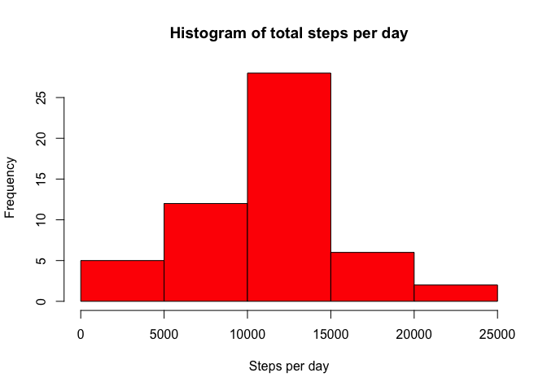
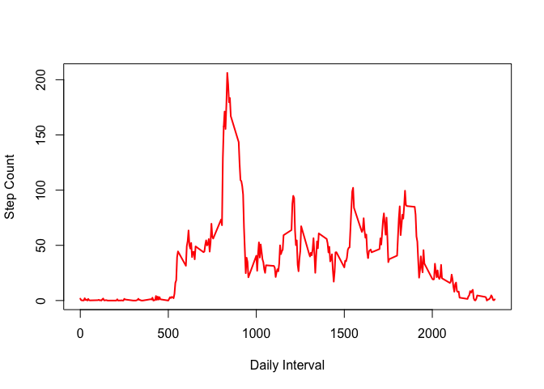
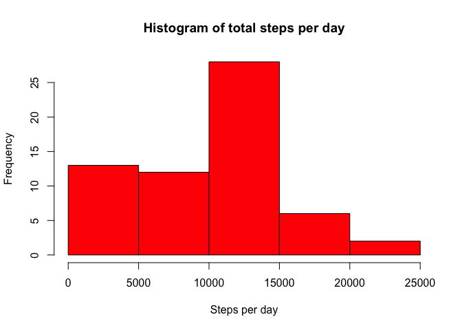
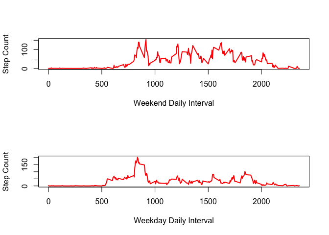

# Reproducible Research: Peer Assessment 1

This is my report for Peer Assessment 1 for the Coursera course "Reproducible Research".

## Loading and preprocessing the data

To load the data we do this and then subset out the NA values:


```r
dfWithNAs = read.csv("activity.csv")
df = dfWithNAs[is.na(dfWithNAs$steps) == F,]
df$date = as.Date(df$date)
```


## What is mean total number of steps taken per day?

First we group the data by day. Then plot the histogram:

```r
byDay = ddply(df, c("date"), function(x) c(count=sum(x$steps)))
hist(byDay$count, col="red", main="Histogram of total steps per day",xlab="Steps per day") 
```

 
  

- The mean steps per day is 1.0766 &times; 10<sup>4</sup> 
- The median steps per day is 10765

## What is the average daily activity pattern?

First, we group the data by interval. Then plot the time series:

```r
byInterval = ddply(df, c("interval"), function(x) c(count=mean(x$steps)))

plot(byInterval$interval,byInterval$count, xlab="Daily Interval", ylab="Step Count", type="l", col="red", lwd="2")
```

 

Interval with the maximum number of steps as averaged across the data set: 835

## Imputing missing values


```r
missing = nrow(dfWithNAs[is.na(dfWithNAs$steps) == T,])
```
1. The total number of missing values in the data is 2304. 

2. Let's fill in the missing data with the last non-NA value.


```r
filledInData = dfWithNAs
filledInData$steps = na.fill(filledInData$steps,"extend")
```

3. There's the new data set. Let's group by day and plot it.


```r
filledInByDay = ddply(filledInData, c("date"), function(x) c(count=sum(x$steps)))
hist(filledInByDay$count, col="red", main="Histogram of total steps per day",xlab="Steps per day") 
```

 

4. The new histogram is very different from the old one! 
- The mean steps per day is 9354.2295 
- The median steps per day is 1.0395 &times; 10<sup>4</sup>
- These values differ from the earlier mean (diff = 1411.9592) and median (diff = 370).
- The impact of imputing the missing values is significant.


## Are there differences in activity patterns between weekdays and weekends?

1. Create a new variable 'weekday' to represent whether date is weekday or weekend.

```r
filledInData$date = as.Date(filledInData$date)
filledInData$day = weekdays(filledInData$date)
filledInData$is_weekend = filledInData$day == "Saturday" | filledInData$day == "Sunday"
filledInData$weekday <- factor(ifelse(filledInData$is_weekend,"weekend","weekday"))
```

2. Create a plot of weekend and weekday patterns


```r
byIntervalWeekend = ddply(filledInData[filledInData$weekday=="weekend",], c("interval"), function(x) c(count=mean(x$steps)))

byIntervalWeekday = ddply(filledInData[filledInData$weekday=="weekday",], c("interval"), function(x) c(count=mean(x$steps)))

par(mfrow=c(2,1))

plot(byIntervalWeekend$interval,byIntervalWeekend$count, xlab="Weekend Daily Interval", ylab="Step Count", type="l", col="red", lwd="2")
plot(byIntervalWeekday$interval,byIntervalWeekday$count, xlab="Weekday Daily Interval", ylab="Step Count", type="l", col="red", lwd="2")
```

 
